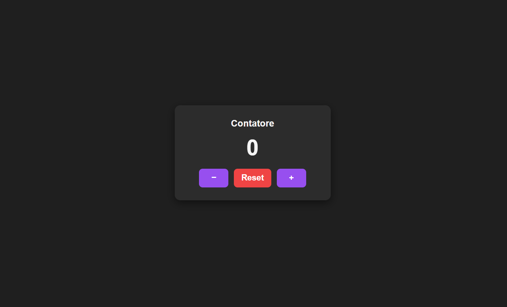

# Paloma Fuerte - Counter



[](https://developer.mozilla.org/en-US/docs/Web/HTML)
[](https://developer.mozilla.org/en-US/docs/Web/CSS)
[](https://developer.mozilla.org/en-US/docs/Web/JavaScript)
[](https://progetto-javascript-di-paloma-fuerte.netlify.app)

## Descrizione del progetto

Semplice applicazione web in JavaScript puro che permette di aumentare, diminuire o resettare un contatore. L'interfaccia viene creata dinamicamente tramite manipolazione del DOM, senza l'utilizzo di framework o librerie esterne.

## Tecnologie utilizzate

- **HTML5** e **CSS3** per la struttura e lo stile della pagina
- **JavaScript** puro per tutta la logica del contatore e manipolazione del DOM
- Immagini create con **Canva**

## Funcionalidades

- Incremento del contatore (+)
- Decremento del contatore (−)
- Reset del contatore a 0
- Uso della tastiera:
  - ArrowUp o + → incrementa
  - ArrowDown o - → decrementa
- Accessibilità: pulsanti con aria-label

## Istruzioni per eseguire il progetto localmente

1. Clona il repository sul tuo computer:

```bash
  git clone https://PalomaFuerte.github.io/Progetto-JavaScript-di-Miriam-Paloma-Fuerte-Contreras/.git
```

2. Apri la cartella del progetto.
3. Apri il file index.hmtl con un browser moderno (Chrome, Firefox, Edge, Safari).
4. Interagisci con il contatore usando i pulsanti +, − e Reset, oppure la tastiera (ArrowUp/+ per incrementare, ArrowDown/- per decrementare).

In alternativa, puoi visualizzare il progetto direttamente online tramite GitHub Pages:
[Counter di Paloma Fuerte](https://PalomaFuerte.github.io/Progetto-JavaScript-di-Miriam-Paloma-Fuerte-Contreras/)

Puoi anche vedere e provare il contatore online cliccando qui:  
[Visualizza il contatore su Netlify](https://progetto-javascript-di-paloma-fuerte.netlify.app/)

## Contatti

Puoi contattarmi attraverso i seguenti canali:
Puoi contattarmi attraverso i seguenti canali:

**Email:** lefortbyfuerte@gmail.com
**GitHub:** [Paloma Fuerte](https://github.com/PalomaFuerte)
**LinkedIn:** [Paloma Fuerte](https://www.linkedin.com/in/paloma-fuerte-073160242/)
**Instagram:** [Paloma Fuerte](https://www.instagram.com/fuertepaloma)
